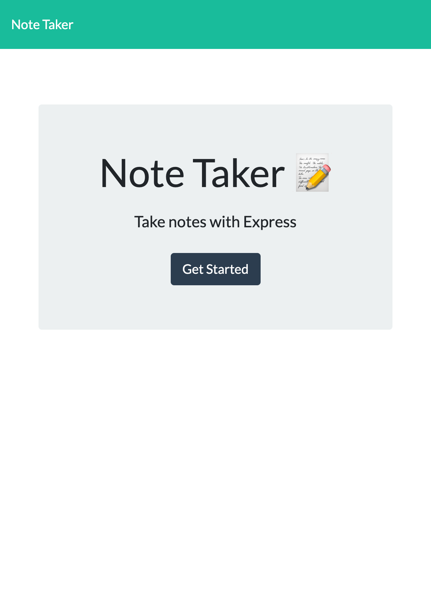
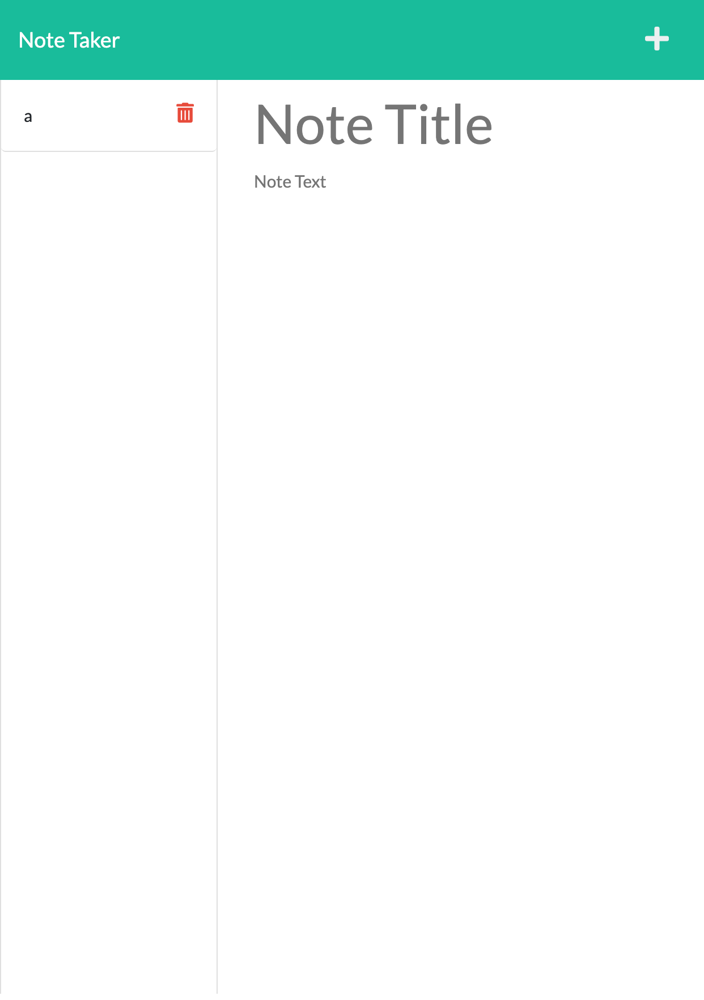

# save-my-notes-app

## Description
This is a basic application that allows users to create notes including a title and a text body to assist them with basic note taking.  Notes are saved so the user can come back and access them whenever.  User is also able to delete notes whether they are created in error or they no longer need them.

## Languages Used
HTML
CSS
JavaScript
Node.js

## Table of Contents
- [Packages Used](#installation)
- [Installation](#installation)
- [Usage](#usage)
- [Links](#installation)
- [Credits](#installation)

## Packages Used
Express
UUID

## Installation
npm i install

## Usage
This application is meant for anyone who needs a quick and easy way to create and manage simple notes

## Links
[Live Deployed Application](https://shrouded-waters-36991.herokuapp.com/)

## Credits
Michael Dougherty [GitHub](https://hithub.com/mjd10m)

